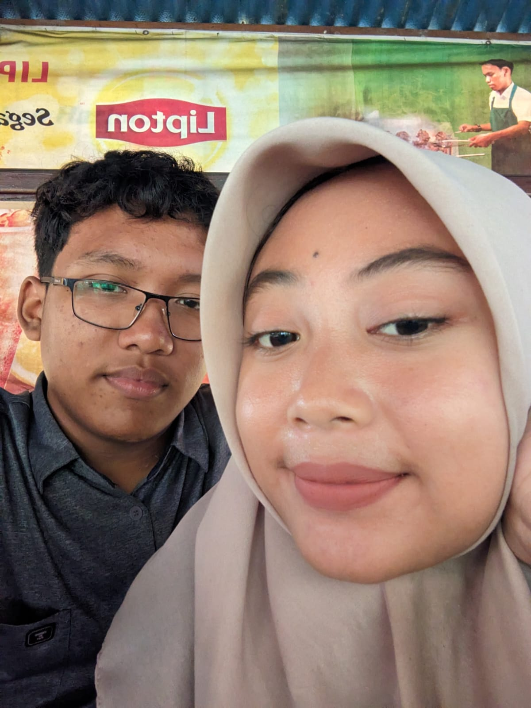

# 🎂 Birthday Website — Panduan Lengkap

> **Website ucapan ulang tahun elegan untuk pacarmu** 💕  
> Dibuat dengan HTML, CSS, dan JavaScript murni — tanpa framework, tanpa library eksternal.

---

## 📁 Struktur Folder

```
birthday-web/
├── index.html          ← Halaman password (pintu masuk)
├── birthday.html       ← Halaman utama ulang tahun
├── css/
│   ├── lock.css        ← Styling halaman password
│   └── birthday.css    ← Styling halaman utama
├── js/
│   ├── lock.js         ← Logic password & animasi kunci
│   └── birthday.js     ← Logic interaktif halaman utama
├── images/             ← Folder untuk foto-foto kamu
│   └── (letakkan foto di sini)
└── README.md           ← Panduan ini
```

---

## 🚀 Cara Menggunakan

### 1. Ganti Password
Buka file `js/lock.js`, cari baris ini di bagian atas:
```javascript
const PASSWORD = "TANGGALLAHIR";
```
Ganti `"TANGGALLAHIR"` dengan tanggal lahir pacarmu dalam format `DDMMYYYY`.

**Contoh:**
- Lahir 14 Februari 2000 → `"14022000"`
- Lahir 3 Agustus 1999 → `"03081999"`
- Lahir 25 Desember 2001 → `"25122001"`

---

### 2. Tambahkan Foto

Ada **3 layout galeri** berbeda. Untuk menambahkan foto asli, kamu perlu mengganti bagian `photo-placeholder` di `birthday.html`.

#### 🖼️ Cara Mengganti Foto di Masonry Grid

Simpan foto ke folder `images/`, misalnya `images/foto1.jpg`

Cari kode seperti ini di `birthday.html`:
```html
<div class="photo-card tall" data-index="1">
  <div class="photo-placeholder">
    ...
  </div>
```

Ganti dengan:
```html
<div class="photo-card tall" data-index="1">
  
```

#### 🎬 Cara Mengganti Foto di Slideshow

Cari `<div class="slide-photo">` dan ganti isinya:
```html
<div class="slide-photo">
  
</div>
```

#### 📷 Cara Mengganti Foto di Polaroid

Cari `<div class="pol-img">` dan ganti:
```html
<div class="pol-img">
  
</div>
```

---

### 3. Personalisasi Teks

Buka `birthday.html` dan cari bagian-bagian ini untuk diganti:

| Bagian | Cari Text | Ganti Dengan |
|--------|-----------|--------------|
| Nama di Hero | `Sayangku 💝` | Nama pacarmu |
| Surat Cinta | Isi paragraf surat | Kata-katamu sendiri |
| Alasan Mencintai | Teks di `.reason-card` | Alasanmu sendiri |
| Final Section | `Sayangku Tercinta` | Nama pacarmu |

---

### 4. Cara Membuka di Browser

Cukup double-click file `index.html` — akan terbuka di browser.  
Atau drag & drop ke browser (Chrome/Firefox/Safari/Edge).

> ⚠️ **Catatan:** Website ini tidak memerlukan server. Langsung buka saja file HTMLnya.

---

## 🎨 Fitur-Fitur Website

### 🔐 Halaman Password (index.html)
- Animasi kunci bergerak naik-turun
- Partikel beterbangan di background
- Hati mengambang di belakang
- Pesan error yang muncul saat salah password
- Hitungan sisa percobaan
- Animasi goncang saat password salah
- Transisi sukses dengan confetti dan redirect otomatis

### 🎂 Halaman Utama (birthday.html)

| Fitur | Keterangan |
|-------|------------|
| **Hero Section** | Judul animasi, ikon melayang, tombol CTA |
| **Confetti** | Meluncur otomatis saat halaman dibuka |
| **Masonry Gallery** | 5 foto dengan hover effect & caption |
| **Cinematic Slideshow** | 4 slide dengan transisi halus, auto-play 5 detik |
| **Polaroid Wall** | 5 foto bergaya polaroid dengan rotasi acak |
| **Surat Cinta** | Amplop yang bisa diklik untuk dibuka |
| **Kue Ulang Tahun** | Lilin interaktif — klik untuk ditiup satu per satu |
| **6 Alasan Cinta** | Kartu animasi dengan scroll reveal |
| **Love Meter** | Progress bar cinta 100% |
| **Final Wish** | Penutup dengan bintang berkedip |

---

## 📱 Responsif

Website otomatis menyesuaikan tampilan di:
- ✅ **Smartphone** (< 600px)
- ✅ **Tablet** (601px – 1024px)
- ✅ **Desktop** (> 1024px)
- ✅ **Large Screen** (> 1400px)

---

## 🎨 Warna & Tema

| Warna | Kode | Digunakan Untuk |
|-------|------|-----------------|
| Rose | `#e8a0bf` | Aksen utama, border, ikon |
| Rose Deep | `#c9547a` | Tombol, gradient |
| Gold | `#d4a853` | Badge, ornamen, highlights |
| Dark | `#1a0a1e` | Background utama |
| Dark Mid | `#2d1040` | Background card |

---

## 🔧 Kustomisasi Lanjutan

### Ganti Font
Font diambil dari Google Fonts. Untuk mengganti, ubah link di `<head>` dan variabel CSS:
```css
font-family: 'Playfair Display', serif;  /* Judul */
font-family: 'Cormorant Garamond', serif; /* Teks biasa */
font-family: 'Dancing Script', cursive;  /* Teks dekoratif */
```

### Ganti Warna Tema
Buka `css/birthday.css` atau `css/lock.css`, ubah variabel di `:root`:
```css
:root {
  --rose: #e8a0bf;       /* Warna utama */
  --rose-deep: #c9547a;  /* Warna tombol */
  --gold: #d4a853;       /* Warna aksen */
}
```

---

## 💡 Tips

1. **Ukuran foto ideal:** Untuk masonry grid gunakan foto portrait (3:4), untuk slideshow gunakan landscape (16:9), untuk polaroid gunakan foto kotak (1:1).
2. **Kompress foto:** Agar loading cepat, kompress foto ke ukuran < 500KB menggunakan [TinyPNG](https://tinypng.com).
3. **Share via WhatsApp:** Kirim folder zip atau hosting di Netlify/Vercel (gratis) lalu kirim linknya.

---

## 🌐 Cara Upload Online (Gratis)

1. Daftar di [netlify.com](https://netlify.com)
2. Drag & drop folder `birthday-web` ke dashboard Netlify
3. Dapatkan link seperti `https://xxxxx.netlify.app`
4. Kirim link ke pacarmu! 💝

---

*Dibuat dengan 💕 untuk momen yang tak terlupakan*
